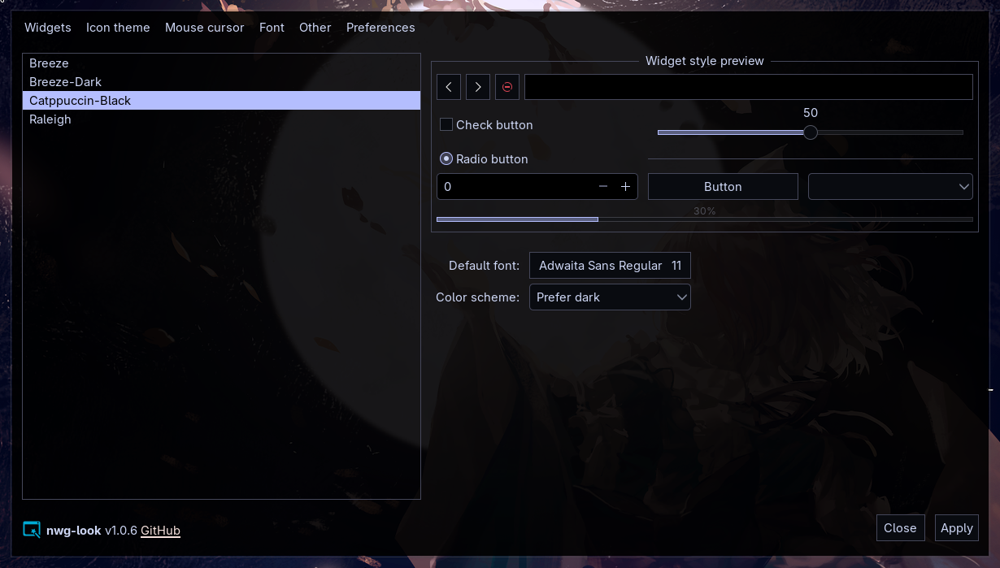

# Catppuccin-Black

A GTK 2/3/4 theme based on [Catppuccin Mocha](https://github.com/catppuccin/catppuccin) with blacked-out backgrounds.

---

## Preview



---

## Palette

| Role | Color |
|---|---|
| Window background | `#000000` @ 90% |
| Content / view background | `#000000` @ 85% |
| Button background | `#090b10` |
| Accent / selection | `#b4befe` Lavender |
| Selection foreground | `#000000` |
| Text | `#cdd6f4` |
| Borders | `#45475a` Surface1 |
| Disabled text | `#585b70` Surface2 |
| Sidebar | `#000000` @ 72% |
| Headerbar | `#090b10` @ 88% |

---

## Requirements

**breeze-gtk** must be installed. The GTK2 and GTK3 files import Breeze widget assets (button shapes, scrollbar graphics, window control SVGs) and only override colors on top.

```bash
# Arch / Manjaro
sudo pacman -S breeze-gtk

# Fedora
sudo dnf install breeze-gtk

# Ubuntu / Debian
sudo apt install breeze-gtk-theme
```

---

## Installation

### Clone into /usr/share/themes

```bash
sudo git clone https://github.com/laperex/catppuccin-black-gtk /usr/share/themes/Catppuccin-Black
```

GTK4 apps (Nautilus, GNOME apps, etc.) ignore `/usr/share/themes` — copy the GTK4 file directly:

```bash
mkdir -p ~/.config/gtk-4.0
cp /usr/share/themes/Catppuccin-Black/gtk-4.0/gtk.css ~/.config/gtk-4.0/gtk.css
```

### Update

```bash
cd /usr/share/themes/Catppuccin-Mocha-Black
sudo git pull
# re-copy the GTK4 file after updating
cp /usr/share/themes/Catppuccin-Mocha-Black/gtk-4.0/gtk.css \
   ~/.config/gtk-4.0/gtk.css
```

---

## Applying the theme

### nwg-look (recommended for niri / wlroots compositors)

```bash
nwg-look
```

Select `Catppuccin-Black` from the Widget tab → Apply.

### gsettings

```bash
gsettings set org.gnome.desktop.interface gtk-theme "Catppuccin-Black"
```

### lxappearance

```bash
lxappearance
```

Select `Catppuccin-Black` from the list → Apply.

---

## Structure

```
Catppuccin-Black/
├── index.theme
├── gtk-2.0/
│   └── gtkrc          # imports Breeze-gtk widgets, overrides color-scheme keys
├── gtk-3.0/
│   └── gtk.css        # @imports Breeze-Dark, then overrides all colors + transparency
└── gtk-4.0/
    └── gtk.css        # standalone, includes libadwaita token overrides for GNOME apps
```

### How it works

**GTK3** — uses `@import` to pull in the full Breeze-Dark theme, then redefines every `@define-color` variable and adds explicit widget rules after it. Later declarations win the CSS cascade, so Breeze provides all widget structure while this theme provides all colors.

**GTK4** — fully standalone. Defines libadwaita named tokens (`window_bg_color`, `accent_color`, `sidebar_bg_color`, etc.) that GNOME apps like Nautilus read directly.

**GTK2** — imports Breeze-gtk widget files individually, then overrides all `gtk-color-scheme` keys.

---
